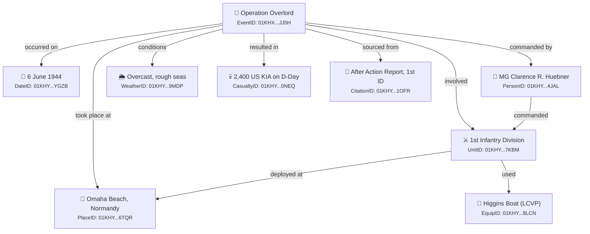

# Speech Visual Aids

## Visual 1: JSON Entity Example

```json
{
  "EventID": "01KHXNSE0W41DV7VV6PEMDJJ5H",
  "Event_Name": "Operation Overlord",
  "Event_Type": "Campaign",
  "Start_Date": "01KHYP2M4N8RQWX3TV5JK7YGZB",
  "End_Date": "01KHYP2M4NCRW9DP6MQXHV2F8A",
  "Sub-events": [
    {
      "Sub-eventID": "01KHXNSE0WX99GG0CB53CD2242",
      "Sub-event_summary": "D-Day landings at Normandy",
      "dates": ["01KHYP2M4N8RQWX3TV5JK7YGZB"],
      "places": ["01KHYP2N5P3FMGW8HN4VCX6TQR"],
      "people": ["01KHYP2P6Q7BNRS2KM9WDY4JAL"],
      "military_units": ["01KHYP2Q8R4CNTP5LN2XEZ7KBM"],
      "equipment": ["01KHYP2R9S5DOUQ6MO3YFA8LCN"],
      "weather": ["01KHYP2SAT6EPVR7NP4ZGB9MDP"],
      "casualties": ["01KHYP2TBU7FQWS8OQ5AHC0NEQ"]
    }
  ],
  "Sources": [
    {
      "CitationID": "01KHYP2UCV8GRXT9PR6BID1OFR",
      "Document": "After Action Report, 1st Infantry Division",
      "Page": "12-14"
    }
  ]
}
```

**Talking point:** "Every entity has a unique ID. Every relationship is an explicit link. You can traverse from any entity to any connected entity across the entire dataset."

---

## Visual 2: Cross-Reference Diagram



**Talking point:** "This is the power of structured data. One event connects to every dimension — who, what, where, when, how, and the source that proves it. And every one of those linked entities connects outward to the rest of the dataset."

---

## Usage Notes

- **JSON slide**: Best displayed with syntax highlighting. Show the full structure, highlight the cross-reference IDs in the sub-event.
- **Diagram slide**: Render the Mermaid diagram as an image. The graph shows how a single event fans out to all 11 entity types.
- **Rendering**: Use [mermaid.live](https://mermaid.live) to export the diagram as SVG/PNG for slides.
