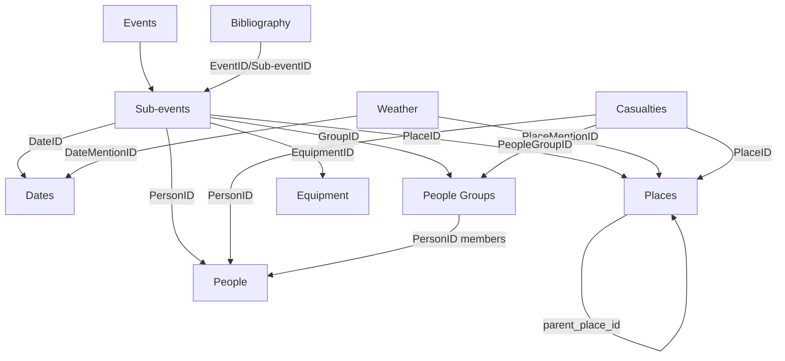

# Entity Relationship Map

**Last Updated:** 2026-06-13

---

## Entity Types (11)

```
Events (top-level container)
├── Sub-events (nested in Event)
│   ├── Dates
│   ├── Places
│   ├── People
│   ├── People Groups
│   ├── Equipment
│   ├── Weather
│   ├── Logistics
│   ├── Casualties
│   ├── Maps
│   └── Bibliography (Supplemental)
```

---

## Cross-Reference Diagram



---

## Cross-Reference Table

| From Entity | Field | References | Notes |
|---|---|---|---|
| Weather | `location.PlaceID` | Places (PlaceID) | Copied from extraction context |
| Weather | `DateID` | Dates (DateID) | Copied from extraction context |
| Casualties | `impacted_organizations[].PeopleGroupID` | People Groups | Should be looked up, often null |
| Casualties | `impacted_people[].PersonID` | People | Should be looked up, often null |
| Casualties | `impacted_places[].PlaceID` | Places | Should be looked up, often null |
| Casualties | `event_context.EventID` | Events | Always present |
| Casualties | `event_context.Sub-eventID` | Sub-events | Always present |
| People Groups | `members[].PersonID` | People | Added during enrichment |
| Places | `hierarchy.parent_place_id` | Places | Added during enrichment |
| All entities | `event_mentions[].EventID` | Events | Present on all entities |
| All entities | `event_mentions[].Sub_eventID` | Sub-events | Present on all entities |

---

## ID Types

| ID Field | Format | Generated By |
|---|---|---|
| EventID | 26-char ULID | LLM (Phase 2) |
| Sub-eventID / Sub_eventID | 26-char ULID | LLM (Phase 2) |
| DateID / DateMentionID | 26-char ULID | LLM (Phase 2) |
| PlaceID / PlaceMentionID | 26-char ULID | LLM or pipeline code |
| PersonID | 26-char ULID | LLM or pipeline code |
| PeopleGroupID | 26-char ULID | LLM or pipeline code |
| EquipmentID | 26-char ULID | LLM (Phase 2) |
| WeatherID | 26-char ULID | LLM (Phase 2) |
| LogisticsID | 26-char ULID | LLM (Phase 2) |
| CasualtyID | 26-char ULID | LLM (Phase 2) |
| BibliographyID | 26-char ULID | LLM (Phase 2) |
| MentionID | 26-char ULID | LLM (per-mention tracking) |

---

## Structural Inconsistencies

### event_mentions vs mentions vs event_context

| Entity Type | Cross-ref Array Name | Structure |
|---|---|---|
| People | `event_mentions[]` | Full: EventID, Sub_eventID, book, author, series, original_text, position_at_event |
| People Groups | `event_mentions[]` | Full (same as people) |
| Places | `event_mentions[]` | Full + role_in_event, date_context |
| Dates | `event_mentions[]` | Full |
| Weather | `event_mentions[]` | Compact: EventID, Sub_eventID, book, author, series |
| Equipment | `event_mentions[]` | Full + paragraph_numbers, using_unit_name |
| Casualties | `event_context{}` | **Single object** (not array): EventID, Sub-eventID |
| Logistics | `event_context{}` | **Single object**: EventID, Sub-eventID |
| Bibliography | `mentions[]` | MentionID, EventID, Sub-eventID, reference_type, reference_number, verbatim_reference |
| Maps | Flat top-level | EventID, Sub-eventID at root level |

### Field Naming Inconsistency

| Pattern | Used In | Alternative |
|---|---|---|
| `Sub-eventID` (hyphen) | Events schema, some mentions | `Sub_eventID` (underscore) |
| `Sub_eventID` (underscore) | Most entity output files | `Sub-eventID` |
| `Sub-event_summary` | Event schema | `Sub_event_Name` in mentions |

---

## Notes for Data Scientists

1. **MentionID** is per-appearance tracking — the same person in different sub-events gets different MentionIDs but the same PersonID.
2. **PlaceMentionID** (from Phase 2 extraction) ≠ **PlaceID** (from consolidated place file). Weather files should reference PlaceID but some have stale PlaceMentionIDs.
3. **EventIDs are unstable across re-extractions** — the same chapter processed twice generates different EventIDs. Use (book, chapter, Sub_event_Name) as the stable identity.
4. **Casualties and Logistics are keyed by Sub-eventID** in their original extraction format but stored as individual files with a CasualtyID/LogisticsID as primary key.
