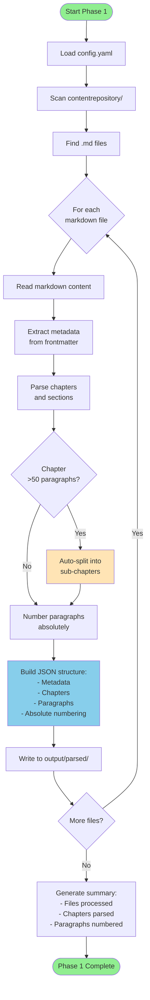
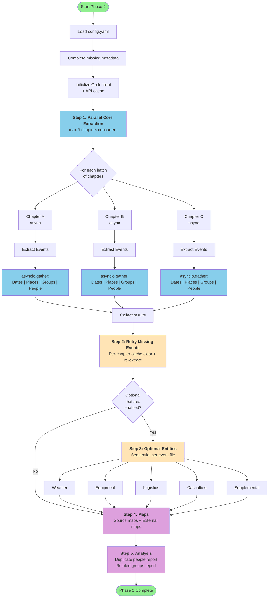
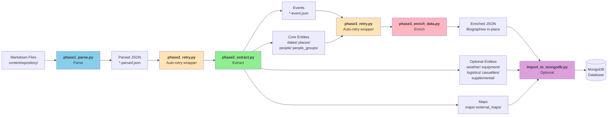
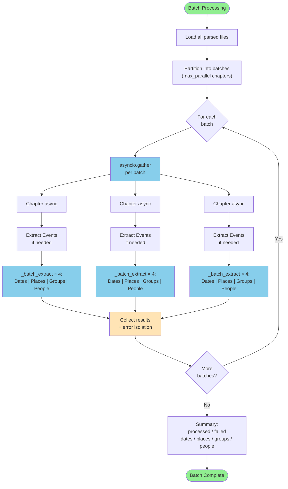
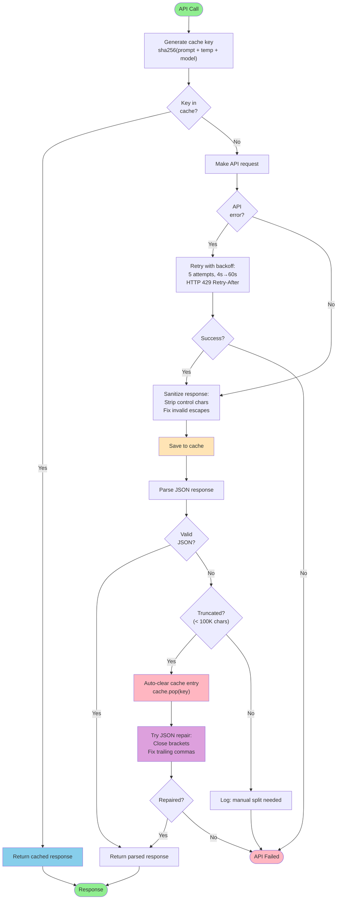
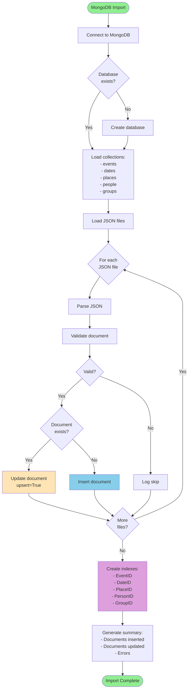
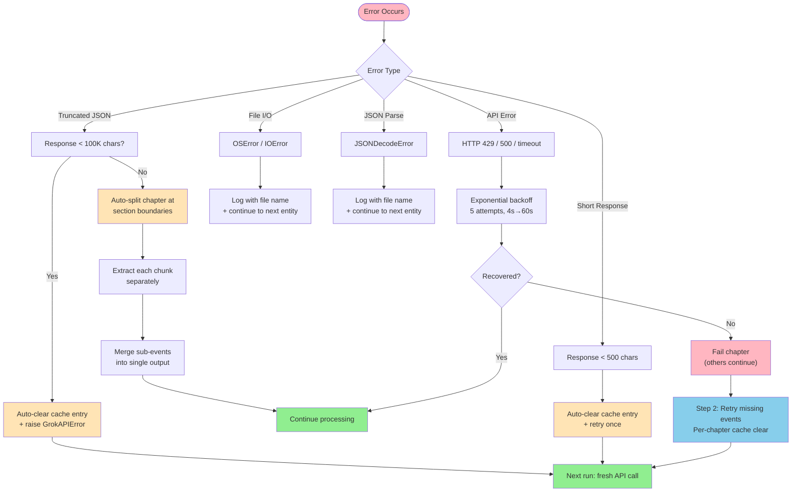
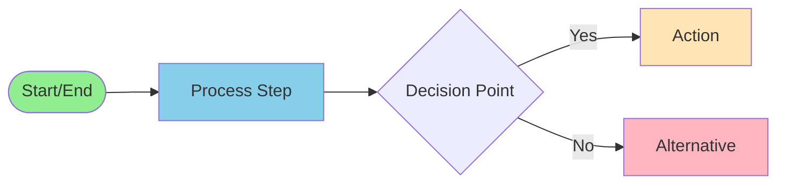

# Pipeline Workflow Diagrams

Visual representations of the WWII data extraction pipeline phases.

---

## Phase 1: Parse Workflow

**Key Operations:**
- Markdown → JSON conversion
- Absolute paragraph numbering
- Auto-splitting large chapters
- Metadata extraction

---

## Phase 2: Extract Workflow

**Key Operations:**
- Parallel chapter processing (async/await)
- Batched API calls (4 entity types per chapter in parallel)
- Per-chapter cache clearing on retry (not full cache wipe)
- Optional entities run sequentially per event file
- Analysis reports generated at end

---

## Phase 3: Enrich Workflow

```mermaid
flowchart TD
    Start([Start Phase 3]) --> LoadConfig[Load config.yaml]
    LoadConfig --> InitGrok[Initialize Grok client<br/>+ API cache]
    InitGrok --> LoadPeople["Load people JSON files<br/>(skip index, duplicate_report,<br/>not_duplicates)"]
    
    LoadPeople --> ForEachPerson{For each<br/>person file}
    ForEachPerson --> GetName{Has<br/>name?}
    GetName -->|No| SkipPerson[Skip file]
    GetName -->|Yes| SearchGrok["Search Grokipedia<br/>HTTP GET with timeout"]
    
    SearchGrok --> GrokFound{Text<br/>found?}
    GrokFound -->|Yes| ExtractGrok["Grok AI: extract structured JSON<br/>birth/death, ranks, units,<br/>awards, education, family,<br/>source_urls"]
    GrokFound -->|No| SearchWiki
    ExtractGrok --> MergeGrok["Merge into bio_profile<br/>(simple fields, lists, family)"]
    MergeGrok --> SearchWiki
    
    SearchWiki["Search Wikipedia API"] --> WikiFound{Text<br/>found?}
    WikiFound -->|Yes| ExtractWiki["Grok AI: extract structured JSON<br/>(same schema + source_urls)"]
    WikiFound -->|No| CheckRefs
    ExtractWiki --> MergeWiki[Merge into bio_profile]
    MergeWiki --> CheckRefs
    
    CheckRefs{References<br/>enabled?}
    CheckRefs -->|Yes| FollowRefs["Follow up to 3 references<br/>Grokipedia → Wikipedia fallback"]
    CheckRefs -->|No| ValidateURLs
    FollowRefs --> MergeRefs[Merge reference data]
    MergeRefs --> ValidateURLs
    
    ValidateURLs{Source URLs<br/>returned?}
    ValidateURLs -->|Yes| FetchURLs["Fetch each URL<br/>(HTTP GET)"]
    ValidateURLs -->|No| CheckEnriched
    
    FetchURLs --> URLExists{HTTP 200?}
    URLExists -->|No| MarkBroken["Mark URL broken"]
    URLExists -->|Yes| GrokVerify["Submit page content to Grok:<br/>Is this about the person?<br/>Contains relevant bio data?"]
    
    GrokVerify --> Relevant{Relevant?}
    Relevant -->|Yes| StoreURL["Add to biography_sources<br/>(confidence: 0.9)"]
    Relevant -->|No| MarkIrrelevant["Discard URL"]
    
    MarkBroken --> CheckEnriched
    StoreURL --> CheckEnriched
    MarkIrrelevant --> CheckEnriched
    
    CheckEnriched{Any new<br/>data added?}
    CheckEnriched -->|No| LogNoData["Log: no new data found"]
    CheckEnriched -->|Yes| Validate["Validate with Person model<br/>(Pydantic)"]
    
    Validate --> ValidOK{Valid?}
    ValidOK -->|Yes| SaveJSON["Save updated person JSON<br/>in-place"]
    ValidOK -->|No| LogError["Log validation error<br/>+ skip save"]
    
    SaveJSON --> NextPerson
    LogNoData --> NextPerson
    LogError --> NextPerson
    SkipPerson --> NextPerson{More<br/>people?}
    
    NextPerson -->|Yes| ForEachPerson
    NextPerson -->|No| Summary["Summary:<br/>enriched / total people"]
    
    Summary --> End([Phase 3 Complete])
    
    style Start fill:#90EE90
    style End fill:#90EE90
    style SearchGrok fill:#FFB6C1
    style SearchWiki fill:#FFB6C1
    style ExtractGrok fill:#87CEEB
    style ExtractWiki fill:#87CEEB
    style Validate fill:#DDA0DD
    style FollowRefs fill:#FFE4B5
    style FetchURLs fill:#FFB6C1
    style GrokVerify fill:#87CEEB
    style StoreURL fill:#90EE90
```

**Key Operations:**
- Two-source search: Grokipedia first, then Wikipedia (both results merged)
- Grok AI extracts structured biographical JSON from raw source text, including source URLs
- Reference following: up to 3 referenced entities searched for additional context
- URL validation: each source URL is fetched, then page content submitted to Grok to verify relevance
- Pydantic model validation before saving
- All API responses cached (Grok client cache)
- Currently people-only; weather/maps enrichment planned but not yet implemented

---

## Complete Pipeline Flow

---

## Event Extraction Detail

---

## Entity Deduplication Flow

---

## Validation Workflow

---

## Batch Processing Flow

**Key Design:**
- Two-level parallelism: chapters concurrent + entities concurrent within each chapter
- Shared `_batch_extract` helper for all 4 entity types (dates, places, groups, people)
- `return_exceptions=True` — one entity failure doesn't stop others
- Per-chapter error isolation — one chapter failure doesn't stop the batch
- Targeted cache clearing on failure (per-entry, not full wipe)

---

## Cache Management Flow

**Key Design:**
- Cache key = sha256 of prompt + temperature + model
- Per-type cache directories: `cache/api/{events,dates,places,people,...}`
- Auto-clear corrupted entries (truncated/short responses) — no manual intervention
- JSON repair attempted before failing
- Retry with exponential backoff + HTTP 429 Retry-After support

---

## MongoDB Import Flow

---

## Error Handling & Recovery Flow

**Key Principles:**
- Errors are isolated: one chapter/entity failure doesn't stop the pipeline
- Cache corruption auto-clears the specific entry (not the whole cache)
- Truncated responses auto-split the chapter at section boundaries and re-extract
- Retry step catches anything missed in the parallel phase
- All error messages include file context for debugging

---

## Legend

**Colors:**
- 🟢 Green: Start/End points
- 🔵 Blue: Core processing steps
- 🟡 Yellow: Optional/alternative steps
- 🔴 Pink: API calls/external operations
- 🟣 Purple: Data operations (merge, deduplicate, index)

---

**Generated:** 2026-03-15  
**Pipeline Version:** 2.0
