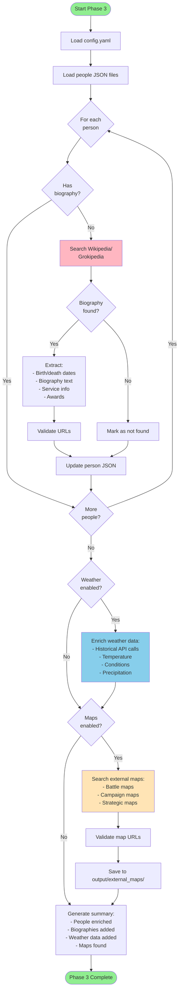
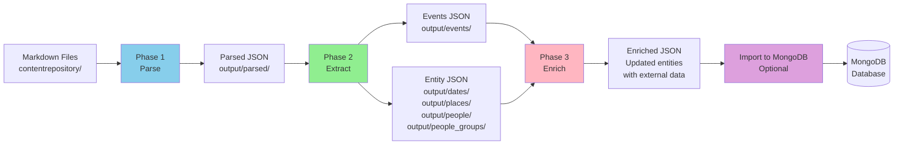
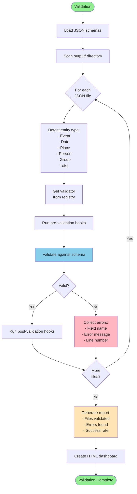
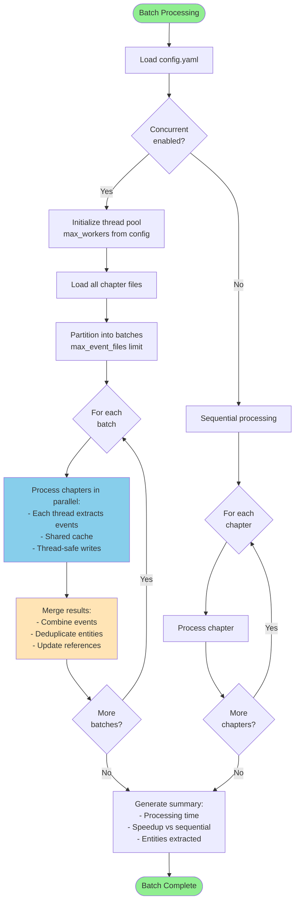
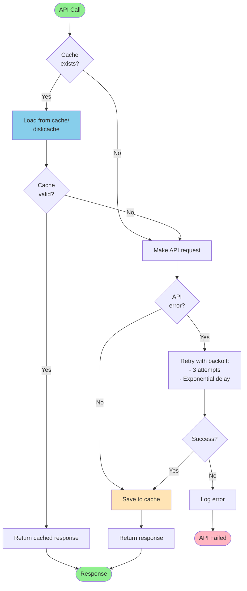

# Pipeline Workflow Diagrams

Visual representations of the WWII data extraction pipeline phases.

---

## Phase 1: Parse Workflow

**Key Operations:**
- Markdown → JSON conversion
- Absolute paragraph numbering
- Auto-splitting large chapters
- Metadata extraction

---

## Phase 2: Extract Workflow

```mermaid
flowchart TD
    Start([Start Phase 2]) --> LoadConfig[Load config.yaml]
    LoadConfig --> InitCache[Initialize API cache]
    InitCache --> LoadParsed[Load parsed JSON files]
    
    LoadParsed --> ForEachChapter{For each<br/>chapter}
    ForEachChapter --> CheckCache{Cache<br/>exists?}
    CheckCache -->|Yes| LoadCache[Load from cache]
    CheckCache -->|No| CallAPI[Call Grok API]
    
    CallAPI --> ExtractEvents[Extract Events<br/>with hierarchy]
    ExtractEvents --> SaveCache[Save to cache]
    SaveCache --> ProcessEvents
    LoadCache --> ProcessEvents[Process events]
    
    ProcessEvents --> ExtractCore[Extract Core Entities:<br/>- Dates<br/>- Places<br/>- People<br/>- Groups]
    
    ExtractCore --> CheckOptional{Optional<br/>features<br/>enabled?}
    CheckOptional -->|Yes| ExtractOptional[Extract Optional:<br/>- Weather<br/>- Equipment<br/>- Logistics<br/>- Maps]
    CheckOptional -->|No| SaveEntities
    ExtractOptional --> SaveEntities
    
    SaveEntities[Save Entities] --> SaveEvents[Save to output/events/]
    SaveEvents --> SaveDates[Save to output/dates/]
    SaveDates --> SavePlaces[Save to output/places/]
    SavePlaces --> SavePeople[Save to output/people/]
    SavePeople --> SaveGroups[Save to output/people_groups/]
    
    SaveGroups --> CheckOpt2{Optional<br/>enabled?}
    CheckOpt2 -->|Yes| SaveOptional[Save optional entities]
    CheckOpt2 -->|No| NextChapter
    SaveOptional --> NextChapter{More<br/>chapters?}
    
    NextChapter -->|Yes| ForEachChapter
    NextChapter -->|No| Dedup[Run deduplication:<br/>- Merge duplicate people<br/>- Merge duplicate places<br/>- Link related groups]
    
    Dedup --> Summary[Generate summary:<br/>- Events extracted<br/>- Entities created<br/>- API calls made<br/>- Cache hits]
    
    Summary --> End([Phase 2 Complete])
    
    style Start fill:#90EE90
    style End fill:#90EE90
    style CallAPI fill:#FFB6C1
    style ExtractCore fill:#87CEEB
    style ExtractOptional fill:#FFE4B5
    style Dedup fill:#DDA0DD
```

**Key Operations:**
- Event extraction with hierarchy
- Entity extraction (dates, places, people, groups)
- Optional features (weather, equipment, logistics, maps)
- API caching
- Deduplication

---

## Phase 3: Enrich Workflow

**Key Operations:**
- Wikipedia/Grokipedia biographical enrichment
- Historical weather data
- External map search
- URL validation

---

## Complete Pipeline Flow

---

## Event Extraction Detail

```mermaid
flowchart TD
    Start([Event Extraction]) --> ParseText[Parse chapter text]
    ParseText --> IdentifyEvents[Identify events<br/>using Grok AI]
    
    IdentifyEvents --> CreateEvent[Create Event:<br/>- EventID ULID<br/>- Event name<br/>- Summary]
    
    CreateEvent --> HasSubEvents{Has<br/>sub-events?}
    HasSubEvents -->|Yes| CreateSubEvents[Create Sub-events:<br/>- Sub-eventID ULID<br/>- Summary<br/>- Paragraph refs]
    HasSubEvents -->|No| ExtractEntities
    CreateSubEvents --> ExtractEntities
    
    ExtractEntities[Extract Entities] --> ExtractDates[Extract Dates:<br/>- DateID ULID<br/>- Date string<br/>- Precision<br/>- Paragraph refs]
    
    ExtractDates --> ExtractPlaces[Extract Places:<br/>- PlaceID ULID<br/>- Name<br/>- GPS coordinates<br/>- Type]
    
    ExtractPlaces --> ExtractPeople[Extract People:<br/>- PersonID ULID<br/>- Name<br/>- Rank<br/>- Role<br/>- Unit]
    
    ExtractPeople --> ExtractGroups[Extract Groups:<br/>- GroupID ULID<br/>- Name<br/>- Type<br/>- Parent unit]
    
    ExtractGroups --> LinkEntities[Link Entities:<br/>- Event → Sub-events<br/>- Sub-events → Dates<br/>- Sub-events → Places<br/>- Sub-events → People<br/>- People → Groups]
    
    LinkEntities --> SaveEvent[Save event JSON]
    SaveEvent --> SaveEntities[Save entity JSON files]
    SaveEntities --> End([Extraction Complete])
    
    style Start fill:#90EE90
    style End fill:#90EE90
    style CreateEvent fill:#87CEEB
    style ExtractEntities fill:#FFE4B5
    style LinkEntities fill:#DDA0DD
```

---

## Entity Deduplication Flow

```mermaid
flowchart TD
    Start([Deduplication]) --> LoadPeople[Load all people JSON]
    LoadPeople --> ComparePeople[Compare people:<br/>- Name similarity<br/>- Rank match<br/>- Unit match<br/>- Date overlap]
    
    ComparePeople --> FindDupes{Duplicates<br/>found?}
    FindDupes -->|Yes| MergePeople[Merge people:<br/>- Combine data<br/>- Update references<br/>- Keep one ULID]
    FindDupes -->|No| LoadPlaces
    MergePeople --> LoadPlaces
    
    LoadPlaces[Load all places JSON] --> ComparePlaces[Compare places:<br/>- Name similarity<br/>- GPS proximity<br/>- Type match]
    
    ComparePlaces --> FindPlaceDupes{Duplicates<br/>found?}
    FindPlaceDupes -->|Yes| MergePlaces[Merge places:<br/>- Combine data<br/>- Update references<br/>- Keep one ULID]
    FindPlaceDupes -->|No| LoadGroups
    MergePlaces --> LoadGroups
    
    LoadGroups[Load all groups JSON] --> CompareGroups[Compare groups:<br/>- Name similarity<br/>- Type match<br/>- Parent unit]
    
    CompareGroups --> FindGroupDupes{Related<br/>groups?}
    FindGroupDupes -->|Yes| LinkGroups[Link groups:<br/>- Parent-child<br/>- Sibling units<br/>- Update hierarchy]
    FindGroupDupes -->|No| Summary
    LinkGroups --> Summary[Generate report:<br/>- People merged<br/>- Places merged<br/>- Groups linked]
    
    Summary --> End([Deduplication Complete])
    
    style Start fill:#90EE90
    style End fill:#90EE90
    style MergePeople fill:#FFB6C1
    style MergePlaces fill:#87CEEB
    style LinkGroups fill:#FFE4B5
```

---

## Validation Workflow

---

## Batch Processing Flow

---

## Cache Management Flow

---

## MongoDB Import Flow

---

## Legend

**Colors:**
- 🟢 Green: Start/End points
- 🔵 Blue: Core processing steps
- 🟡 Yellow: Optional/alternative steps
- 🔴 Pink: API calls/external operations
- 🟣 Purple: Data operations (merge, deduplicate, index)

---

**Generated:** 2026-03-13  
**Pipeline Version:** 2.0
