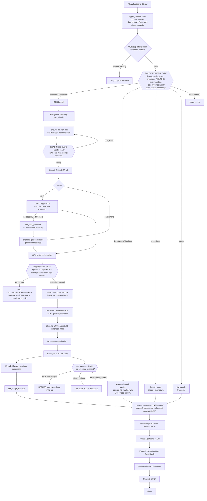

# Ingestion Front Door — Current State (OCR is one branch)

_Branch: `feature/concurrency-parallelism` · Last updated: 2026-09-29_

Status of the unattended, document-parallel WWII pipeline. **OCR (scanned PDFs /
images) is only one intake branch** — the front door also takes HTML, EPUB,
DOCX, TXT, and Markdown, each with a different conversion route into the common
parse → extract → enrich chain.

---

## Intake is multi-format (OCR is a subset)

Source formats and their intended route to Markdown (the common substrate the
parse/extract chain consumes):

| Format | Media type | Track | Route to Markdown |
|--------|-----------|-------|-------------------|
| Scanned PDF | `pdf` | narrative | **OCR** (Chandra GPU Batch) |
| Digital PDF | `pdf` | narrative | text extract / OCR fallback (`pdf_pipeline`) |
| Image (jpg/png/tif/…) | `image` | vision | **OCR** (Chandra) + caption |
| DOCX | `docx` | narrative | **pandoc** (`docx_to_markdown`) |
| EPUB | `epub` | narrative | **pandoc** (`epub_to_markdown`) |
| HTML | `html` | narrative | HTML→md (`web_video` / pandoc) |
| TXT | `text` | narrative | `txt_to_markdown` |
| Markdown | `text` | narrative | passthrough (already md) |
| Video | `moving_image` | av | transcript (`web_video` + transcriber) |
| Archive (.zip/.rar) | — | — | expanded by pre-stage; never processed directly |
| unsupported | `unsupported` | skip | → `needs-review` |

The conversion capability already exists in `src/ingestion/`:
- `media_detection.detect_media_type` — content-type + extension + magic-byte sniff
- `text_converters.convert_to_markdown` → `docx/epub/txt_to_markdown` (pandoc)
- `pdf_pipeline.convert_pdf_to_markdown` + `_is_scanned_pdf` (digital vs scanned)
- `web_video` — HTML/video capture + transcription
- `prestage.route_file` → `_ROUTING` table (the intended per-format router)

### Gap to close (routing)

`prestage._ROUTING` is the **intended** per-media-type router, but the deployed
Lambda `trigger_handler._split_by_media` currently does only a coarse split:

```python
# trigger_handler._split_by_media (current)
pdfs   = [k for k in keys if k.endswith(".pdf")]   # -> OCR
others = [everything else]                          # -> parse (assumes markdown!)
```

So **images, EPUB, HTML, DOCX are sent straight to the markdown parse path**
instead of through their conversion step. PDFs correctly go to OCR; the rest
should be split into: `convert` (docx/epub/html/txt → pandoc), `ocr`
(image), and `passthrough` (md) — mirroring `prestage._ROUTING`. The converters
exist; the Lambda router just needs to call them (or defer to Phase 0
`route_file`). Tracked as a follow-up.

---

## Where the OCR branch is (verified this session)

The OCR RUNNABLE-stall and the follow-on container-pull failure are **both
fixed and deployed**. A live on-demand OCR job (`B406`, 11 pages) has:

1. Passed the **readiness gate** (NAT + all 7 VPC interface endpoints
   `available`) before compute was requested.
2. **Registered** its GPU instance with the ECS/Batch cluster (the thing that
   failed every prior attempt).
3. **Pulled the Chandra image** via the ECR endpoints (past the point that
   failed with `CannotPullECRContainerError`).
4. Loaded the model and is **OCR-ing pages 1..11** under the progress watchdog.

Remaining to fully close the OCR branch: let the job finish →
`ocr-output/B406/…` → EventBridge → merge Lambda writes the chapter structure →
parse triggers; then tear down.

### Two root causes fixed this session

| # | Symptom | Root cause | Fix (commit) |
|---|---------|-----------|--------------|
| 1 | GPU job stuck RUNNABLE; instance launches but never registers | NAT + interface endpoints not reliably up at boot; nat_manager **create-after-delete race** (a `deleting` endpoint counted as "present" → recreation skipped) | Readiness contract `_verify_ready` + exclude `deleting` from the exists-check + `_wait_out_deleting` (`4bb5ee0`) |
| 2 | Instance registers, job RUNNING, then `CannotPullECRContainerError` (ECR auth timeout) | A **direct `action=delete`** tore down NAT+endpoints **under a running job** — the demand guard only ran on the SNS path | Move demand guard **into `_delete_all`** (every delete path honors in-flight OCR); `force=True` for intentional teardown (`561e71f`) |

### Not a bug (clarified)

- **Spot not placing immediately is expected.** Spot waits for capacity; the
  Option-B controller falls back to on-demand after the threshold (48h cap).
  On-demand places immediately (768 quota). Only the spot *quota* matters, and
  the ≥80% warning already surfaces it.

---

## Flow + decision points



### Key decision points (numbered)

0. **Route by media type** — `detect_media_type` (content-type + extension +
   magic bytes) → `prestage._ROUTING` picks the branch: OCR (scanned pdf /
   image), convert (docx/epub/html/txt → pandoc), passthrough (markdown), av
   (video), or skip (unsupported → needs-review). **All branches converge on
   Markdown**, then the common parse → extract → enrich chain. *(Gap: the
   deployed Lambda router only splits pdf-vs-rest today — see above.)*
1. **OCR intake claim** — `ocr#{book}` DynamoDB claim guards the whole chunk
   set; duplicate submits denied at the front door (dedup principle).
2. **Chunking** — page-count > 50 → 50-page chunks; image → single; unknown →
   safe whole fallback (`_ocr_chunks`).
3. **Readiness gate** (`_verify_ready`) — compute is **not requested** until
   NAT is `available` AND every required interface endpoint is `available`.
   Returns `{ready, missing[]}`. This is what makes registration reliable.
4. **Queue / spot-vs-on-demand** — spot waits for capacity (expected);
   `ocr_spot_controller` falls back to on-demand after the threshold (48h cap).
5. **Registration egress** — the instance needs the 7 interface endpoints
   (ECR/ECS/logs/secrets) to register + pull; S3 uses the gateway endpoint.
6. **Teardown guard** (`_delete_all` + `_nat_demand_present`) — refuses to tear
   down NAT/endpoints while any OCR job is non-terminal on either queue, unless
   `force=true`. Prevents infra being pulled out from under a running job.

---

## Verification evidence (this session)

- `action=verify` → `{"ready": true, "missing": []}` with all 7 endpoints
  available.
- OCR job `3283f45d-…`: RUNNABLE → STARTING (`registered=1`) → RUNNING;
  container log shows PDF downloaded, `Model loaded successfully`,
  `Loaded 11 page(s)`, `Processing pages 1-1...`.
- Gate: `scripts/gate.sh` PASS, 1161 tests (commits `4bb5ee0`, `561e71f`).

## Follow-ups

- **Multi-format routing gap (highest-value):** wire `trigger_handler`
  (`_split_by_media`) to the intended per-media-type routing so images go to
  OCR and docx/epub/html/txt go through their pandoc/`convert_to_markdown`
  step, instead of the current pdf-vs-rest split that sends non-md straight to
  parse. Converters already exist in `src/ingestion/`; defer to `route_file` /
  `_ROUTING`. Needs tests per format.
- EIP release `AuthFailure` on teardown (IAM perm gap) — minor, cleanup only.
- Full-chain close (#5): confirm merge → chapter structure → parse after this
  job SUCCEEDED; then a **true** front-door test (upload via S3 so the trigger
  does chunking + NAT-ensure + claim end-to-end).
- Tear down GPU/NAT after testing.
