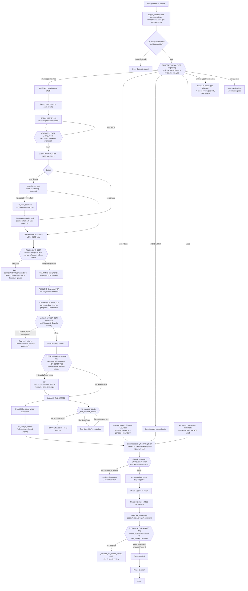

# Ingestion Front Door — Current State (OCR is one branch)

_Branch: `feature/concurrency-parallelism` · Last updated: 2026-09-29_

Status of the unattended, document-parallel WWII pipeline. **OCR (scanned PDFs /
images) is only one intake branch** — the front door also takes HTML, EPUB,
DOCX, TXT, and Markdown, each with a different conversion route into the common
parse → extract → enrich chain.

---

## Intake is multi-format (OCR is a subset)

Source formats and their intended route to Markdown (the common substrate the
parse/extract chain consumes):

| Format | Media type | Route to Markdown | Status |
|--------|-----------|-------------------|--------|
| Scanned PDF | `pdf` | **OCR** (Chandra GPU, 24GB) | ✅ deployed + proven |
| Image (jpg/png/tif/…, incl scanned maps) | `image` | **OCR** (Chandra) | ✅ deployed (`4ea9351`) |
| EPUB | `epub` | **pandoc** via Phase-0 convert task | ✅ deployed + proven (`2b2178d`) |
| DOCX | `docx` | **pandoc** via Phase-0 convert task | ✅ deployed (same path) |
| TXT / Markdown | `text` | passthrough → parse | ✅ deployed |
| HTML | `html` | → parse (pandoc HTML→md is a follow-up) | ⚠️ routes to parse as-is |
| Video | `moving_image` | transcript (`web_video`) + **multimodal speaker-id** | ❌ not wired (task #9) |
| Archive (.zip/.rar) | — | expanded by pre-stage; never processed | n/a |
| Media-type MISMATCH (wrong extension) | (sniffed ≠ declared) | **reject → needs-review** | ❌ not wired (task #8) |
| unsupported | `unsupported` | → `needs-review` | ✅ |

### Router: deployed 3-way split (OCR / convert / parse)

`trigger_handler._split_by_media` now routes by media type (superseding the old
pdf-vs-rest coarse split):

```python
ocr_keys     = pdf + images        # -> Chandra OCR (24GB) -> merge -> parse
convert_keys = epub + docx         # -> Phase-0 convert task (pandoc) -> parse
parse_keys   = md + txt + html     # -> parse directly
```

- **OCR** reuses the proven `_ocr_chunks` (`[""]` single-job for images) →
  `ocr_merge` → `contentrepository/{book}/chapter1/chapter1-content.md`.
- **Convert** (`_submit_convert`) launches the **Phase-0 ECS task**
  (`dev-wwii-phase0-convert`, `phase0_convert.py`): downloads `CONVERT_KEY`,
  `pandoc` → markdown, writes the SAME chapter structure the OCR-merge path
  produces (so parse fires identically). pandoc is in the pipeline image.
- All branches converge on `contentrepository/{book}/chapter1/chapter1-content.md`
  → parse → extract → enrich.

**Remaining routing follow-ups:** HTML→markdown (pandoc, minor); **media-type
mismatch rejection** (task #8 — sniffed type ≠ extension must off-ramp to
needs-review, not process); **video** transcript + multimodal speaker-id
(task #9).

### EPUB path verified (2026-09-30)

Uploaded the Patton epub → trigger routed to convert → Phase-0 task ran
(`pandoc` epub → **1,028,505 chars** markdown in 11s) → wrote the chapter
structure → parse triggered → **72 parsed chunks** → Phase-2 extraction running.
Note: book name derives from the FILENAME (not the upload dir). A transient
egress race (phase0 released NAT before phase1 pulled its image →
`ResourceInitializationError`) self-healed via the dispatcher's CreateNat retry
(NAT pending→available), then phase1 ran. Phase 2/3 continue on the Grok Batch
async cadence.

---

## Where the OCR branch is (verified this session)

The OCR RUNNABLE-stall and the follow-on container-pull failure are **both
fixed and deployed**. A live on-demand OCR job (`B406`, 11 pages):

1. Passed the **readiness gate** (NAT + all 7 VPC interface endpoints
   `available`) before compute was requested.
2. **Registered** its GPU instance with the ECS/Batch cluster (the thing that
   failed every prior attempt).
3. **Pulled the Chandra image** via the ECR endpoints (past the point that
   failed with `CannotPullECRContainerError`).
4. Ran OCR to `SUCCEEDED` with NAT + endpoints held stable throughout (the
   teardown guard, once given `batch:ListJobs`, kept infra up).
5. …but produced **no output** — Chandra hit CUDA OOM on page 1 (16GB g4dn) and
   silently exited 0. This surfaced the GPU-memory handling gap, now fixed
   (below).

### GPU CUDA-OOM handling (layered: anticipate + fail-and-escalate)

The infra chain is proven end-to-end; OOM was the remaining application-layer
gap. Fixed in three layers (commit `84a2a00`):

1. **Fail-loud** — `ocr_watchdog` detects the CUDA-OOM line in Chandra's stream
   and returns `EXIT_OOM (76)` even when Chandra exits 0, so the job fails
   visibly instead of "succeeding" with empty output.
2. **Anticipate-first** — `trigger._pdf_has_large_page` probes page mediabox
   area at submit; oversized pages (the empirical OOM trigger on 16GB) route
   straight to the 24GB high-VRAM queue, skipping a wasted attempt.
3. **Fail-and-escalate** — `ocr_spot_controller._escalate_oom_failures`
   resubmits an OOM-failed job (exit 76) **once** to the high-VRAM queue
   (24GB g5/g6, g4dn excluded); a second OOM there is left FAILED for review.
   This "upsizes + recycles" automatically: Batch scales the failed 16GB
   instance down and launches a fresh 24GB one.

Deployed + verified: `wwii-ocr-dev` UPDATE_COMPLETE with the new
`dev-wwii-chandra-gpu-highvram` queue + `-highvram-v1` CE (ENABLED/VALID);
controller runs `{routed:0, escalated:0, capped:0}` cleanly (escalation path +
IAM confirmed).

### Two root causes fixed this session

| # | Symptom | Root cause | Fix (commit) |
|---|---------|-----------|--------------|
| 1 | GPU job stuck RUNNABLE; instance launches but never registers | NAT + interface endpoints not reliably up at boot; nat_manager **create-after-delete race** (a `deleting` endpoint counted as "present" → recreation skipped) | Readiness contract `_verify_ready` + exclude `deleting` from the exists-check + `_wait_out_deleting` (`4bb5ee0`) |
| 2 | Instance registers, job RUNNING, then `CannotPullECRContainerError` (ECR auth timeout) | A **direct `action=delete`** tore down NAT+endpoints **under a running job** — the demand guard only ran on the SNS path | Move demand guard **into `_delete_all`** (every delete path honors in-flight OCR); `force=True` for intentional teardown (`561e71f`) |

### Not a bug (clarified)

- **Spot not placing immediately is expected.** Spot waits for capacity; the
  Option-B controller falls back to on-demand after the threshold (48h cap).
  On-demand places immediately (768 quota). Only the spot *quota* matters, and
  the ≥80% warning already surfaces it.

---

## Flow + decision points



### Key decision points (numbered)

0. **Route by media type** — `detect_media_type` (content-type + extension +
   magic bytes) → `prestage._ROUTING` picks the branch: OCR (scanned pdf /
   image), convert (docx/epub/html/txt → pandoc), passthrough (markdown), av
   (video), or skip (unsupported → needs-review). **All branches converge on
   Markdown**, then the common parse → extract → enrich chain. *(Gap: the
   deployed Lambda router only splits pdf-vs-rest today — see above.)*
1. **OCR intake claim** — `ocr#{book}` DynamoDB claim guards the whole chunk
   set; duplicate submits denied at the front door (dedup principle).
2. **Chunking** — page-count > 50 → 50-page chunks; image → single; unknown →
   safe whole fallback (`_ocr_chunks`).
3. **Readiness gate** (`_verify_ready`) — compute is **not requested** until
   NAT is `available` AND every required interface endpoint is `available`.
   Returns `{ready, missing[]}`. This is what makes registration reliable.
4. **Queue selection** — two queues: **spot** (default; waits for capacity,
   expected) and **on-demand** (controller fallback after threshold, 48h cap).
   Both restricted to a **24GB-VRAM floor** (g5/g6 only). `ocr_spot_controller`
   owns the spot→on-demand move.
5. **GPU VRAM / OOM** — EMPIRICAL: Chandra needs ~24GB for ANY page (a 16GB g4dn
   OOMs regardless of page size), so g4dn is excluded from all pools. `ocr_watchdog`
   turns a swallowed CUDA OOM into a visible `exit 76`; an OOM on 24GB is
   exceptional → `_flag_oom_failures` alerts + off-ramps to needs-review (no
   auto-retry). The container entrypoint preserves the exit code (no
   silent-success upload).
6. **Registration egress** — the instance needs the 7 interface endpoints
   (ECR/ECS/logs/secrets) to register + pull; S3 uses the gateway endpoint.
7. **Teardown guard** (`_delete_all` + `_nat_demand_present`) — refuses to tear
   down NAT/endpoints while any OCR job is non-terminal on any queue, unless
   `force=true`. Requires `batch:ListJobs` (the audit gap) + fails safe.

---

## Human intervention points (not fully automated)

The pipeline is unattended by default but has explicit human-in-the-loop gates
and review off-ramps. These are real code paths, not aspirational:

| # | Where | Trigger | Human action | Effect |
|---|-------|---------|--------------|--------|
| H1 | **Intake routing** | `unsupported` media type (`prestage._ROUTING` → skip) | inspect the source | doc set to `needs-review` (terminal), not processed |
| **H2** | **OCR → Markdown review** (`mdreview_ui_handler`, `/mdreview` UI) — **BUILT + TESTED, NOT DEPLOYED** (commit `d1c9869`) | OCR of a scanned page needs verification (the OCR+AI markdown is the *source of truth* for reference material) | two-pane page-image + editable snippet; save to `ocr-output/{book}/reviewed/pN.md` | merge-time **consume-once substitution** in `merge_outputs` — reviewed page replaces the raw OCR page before the chapter markdown is written. **Indefinite human pause** (like dedup); NAT torn down while waiting, resumed on completion |
| H3 | **Structure detection** (`markdown_structure`, `web_video`) | weak/ambiguous detection (block quotes, flattened tables, pending video transcription) → `needs_review=True` | confirm/correct the span | only `needs_review=False` spans are auto-applied; weak ones await confirmation |
| H4 | **OOB reference parsing** (`oob_markdown/*`) | suspect cell (empty/garbled/unknown) or fuzzy name crosswalk → `needs_review` + `review_count` | verify the flagged rows/links | verification-only (never auto-corrected); low confidence recorded |
| H5 | **Dedup review gate** (`dedup_ui_handler`, `/dedup` web UI) | duplicate groups detected in Phase 2 (`duplicate_report.json` for people/places/groups/equipment) | merge / skip / exclude each group, then `POST /dedup/api/complete` | **ungates Phase 3** — enrichment is blocked until review is marked done |
| H6 | **Doc off-ramp** (`_offramp_doc_needs_review`, `ecs_entrypoint`) | dedup gate blocks a doc in multi-doc mode | review the doc | doc lifecycle → `needs-review`; dispatcher stops advancing it |
| H7 | **Operator alerts** (both email + Slack) | phase completion, financial/quota warnings, failures | acknowledge / act | informational + actionable deep links; some (quota ≥80%) prompt action |

Two **blocking human gates** are indefinite async pauses, and NAT follows the
same lifecycle for both (UP across compute, **DOWN while waiting on a reviewer**,
resumed on completion):
- **H2 — OCR→Markdown review** (built, not yet deployed): reviewed pages
  substitute into the merge; the OCR+AI markdown is the source of truth for
  scanned reference material.
- **H5 — Dedup review**: Phase 2 duplicate reports resolved via the web UI;
  only then is Phase 3 ungated.

Everything else (H1, H3, H4, H6) is a **review off-ramp** — flagged items divert
to `needs-review` while the rest of the corpus flows on.


All branches converge on Markdown in `contentrepository/{book}/chapter{N}/`
(content + `-meta.yaml`). From there:

### Phase 1 — Parse (`phase1_parse.py`) → structured JSON per chapter

Deterministic, no LLM. `discover_content_structure` walks the book/chapter
layout; `parse_chapter` turns each Markdown chapter into a serializable
document. **Produces** (one JSON per chapter) with:
- **Metadata**: `book`, `chapter_number`, `chapter_title`, `section_id`,
  `author`, `series`, `license`, `source_file`.
- **Paragraphs**: ordered, each with `absolute_number`, `text`, `page_number`,
  `section_id`, `source_file`, and quote flags (`is_quote`,
  `quote_attribution`) — this is the unit of provenance later extraction cites.
- **Images / maps / footnotes**: `resource_id`/`url`/`alt_text`/`caption`,
  `map_id`, footnote `number`→`url`.
- **`table_hints`**: spans of flattened/scanned tables for downstream repair.

This is the citable substrate: page/paragraph numbers + verbatim text, no
interpretation yet.

### Phase 2 — Extract (`phase2_extract.py`) → 11 cross-referenced entity types

LLM extraction via the **Grok Batch API** (50% discount). Runs in stages:
metadata completion (fills incomplete `-meta.yaml` via Grok) →
`extract_events` (the event-centric spine) → the typed entity extractors →
`import_maps` → **dedup reports** (`find_duplicate_people`,
`find_related_groups`). **Produces** JSON keyed by ULID, all linked back to
events via `event_mentions` (the junction that carries book/author/series +
`MentionID` + page context):

| Type | Output | Notable fields |
|------|--------|----------------|
| **Events** | `output/events/*.json` | `EventID`, `Sub-events[]` each with entity-ID arrays (dates/places/people/groups) |
| **Dates** | `output/dates/` | `date_start/end`, `date_precision`, `time_*`, `original_text` |
| **Places** | `output/places/` | `geography_type`, `coordinates` (+`confidence`), `hierarchy`, `map_urls`, `related_places` |
| **People** | `output/people/` | `biographical_profile` (ranks/units/awards) — mostly filled in Phase 3 |
| **People Groups** (units/orgs) | `output/people_groups/` | `group_type`, `military_hierarchy`, `parent_organization`, `members[]` |
| **Weather** | `output/weather/` | deduped by date+location; `extracted_data` (+ api in P3) |
| **Equipment, Logistics, Casualties, Maps, Citations** | `output/…` | typed per schema; Maps/Citations carry source + `verbatim_reference` |

Key property: **event-centric with ULID cross-refs** — an event's sub-event
points at DateID/PlaceID/PersonID/GroupID; each entity carries `event_mentions`
back to the event + source. Dedup runs at the front door (title→ref→author for
bibliography); Phase 2 **entity** duplicates go through the **human dedup review
gate (H5)** before Phase 3 is ungated (see Human intervention points).

### Phase 3 — Enrich (`phase3_enrich_data.py`) → external data merged in

Per-entity enrichment from external sources, merged into the Phase 2 JSON
(never re-extracted):
- **People** (`enrich_all_people`): OpenSERP images + academic/oral-history
  references; `biographical_profile` (birth/death, nationality, ranks,
  units_served, awards) with `biography_sources` + confidence; sets
  `enrichment_status`/`openserp_searched`.
- **Groups** (`enrich_all_groups`): `enrichment_data` (formed/disbanded,
  commanding_officers, notable_operations), resolved `members[]`.
- **Places** (`enrich_all_places` + `link_parent_place_ids`): geocode
  lat/long, hierarchy, bounding box, map URLs; links parent places.
- **Bibliography** (`enrich_bibliography`): resolves/cleans citation entries so
  they point at real sources.
- **Weather**: hybrid extracted + Open-Meteo API where dated+located.

Enrichment is idempotent per the steering discipline (track processed state;
don't re-enrich unchanged content), and emits SNS progress
(Phase 3 in-progress / complete) to both email + Slack.


- `action=verify` → `{"ready": true, "missing": []}` with all 7 endpoints
  available.
- OCR job `3283f45d-…`: RUNNABLE → STARTING (`registered=1`) → RUNNING;
  container log shows PDF downloaded, `Model loaded successfully`,
  `Loaded 11 page(s)`, `Processing pages 1-1...`.
- Gate: `scripts/gate.sh` PASS, 1161 tests (commits `4bb5ee0`, `561e71f`).

### Full-chain validation (2026-09-30) — PROVEN end-to-end + 5 bugs fixed

Ran B400 through the real front door (S3 upload → trigger). The complete chain
is demonstrated working:
`PDF → (24GB) OCR → merge → chapter structure → trigger → dispatcher → phase1
parse → parsed JSON`. Evidence: B400 ran on a **g5.xlarge (24GB)**, OCR'd all 6
pages with **no OOM**, produced `input.md`; merge wrote
`contentrepository/B400/chapter1/chapter1-content.md` + `chapter1-meta.yaml`;
trigger queued it; dispatcher launched a phase1 task; output
`output/content/B400/chapter1full-parsed.json` (13.5KB) + `-event.json` produced.

The validation surfaced + fixed **five** real bugs (each committed, gated,
deployed):
1. **24GB VRAM floor** (`a00cc6e`) — Chandra OOMs on 16GB g4dn for ANY page
   (not size-driven); g4dn removed from all pools, high-VRAM special-casing
   dropped.
2. **Controller stale-claim** (`12c702d`) — `ocrctl#{name}` from a terminal
   prior job blocked re-routing forever; `routed` counted attempts not moves
   (silent no-op). Now reclaims stale (terminal) claims + truthful counter.
3. **Merge trigger queue match** (`0bdfca4`) — ocr-succeeded rule matched only
   the spot queue; on-demand successes never merged. Now matches both.
4. **Container fail-loud** (`a00cc6e`) — Chandra swallowed CUDA OOM + exited 0;
   entrypoint now preserves the watchdog exit code (no silent-success upload).
5. **NAT private-DNS conflict** (`1371c2f`) — dispatcher CreateNat failed while a
   just-deleted endpoint's private-DNS lingered; `_create_endpoint` now waits it
   out + retries.

Gate: `scripts/gate.sh` PASS, 1175 tests. NAT auto-teardown confirmed (guard
allows teardown when no OCR jobs in flight; pipeline completion SNS drives it).


## IAM compliance audit (2026-09-29)

Triggered by a silent-deny bug: nat_manager's teardown guard was **blind**
because its role lacked `batch:ListJobs` — every `list_jobs` call was denied and
swallowed by a per-status `except: continue`, so the guard read "no OCR demand"
and tore down NAT under a running job (twice). Audited every AWS API call each
Lambda makes against the actions its role grants (authoritative — read the
inline policies, since `simulate-principal-policy` false-negatives on
resource-scoped statements).

| Role | Handlers | Finding |
|------|----------|---------|
| `dev-wwii-lambda-role` (shared) | trigger, nat-manager, openserp-manager, batch-poller, ocr-merge, dedup-ui/gate/auth, mdreview-ui, slack-formatter, metrics | **GAP: `batch:ListJobs` missing** (only `batch:SubmitJob` granted). `SubmitJob` also scoped to the spot queue ARN only — missing the on-demand queue. **Both fixed** in `iam.yaml`. All other calls (ecs, sfn start/list, sns, secrets, ec2 nat/endpoints/routes, s3, dynamo, scheduler, ssm, cfn, lambda invoke) properly granted. |
| `dev-wwii-ocr-controller-role` | ocr-spot-controller | Clean — batch Submit/Describe/List/Terminate + servicequotas + sns + dynamo. |
| `dev-wwii-dispatcher-lambda-role` | enumerate-pending, clamp-pool, human-gate | Clean — ecs:ListTasks + servicequotas + sns + states SendTaskSuccess/Failure. |

**Defense-in-depth (code):** `_ocr_jobs_in_flight` now **fails safe** — any
error other than a definitive "queue does not exist" (e.g. `AccessDenied`,
throttling) is treated as *demand present*, never silently ignored. An IAM gap
can no longer silently disable a safety guard.

**Principle recorded:** a swallowed AWS error in a *safety-critical* check
(teardown guards, demand checks) must fail toward the safe state, not the
permissive one.

**Deployed (2026-09-29):** the `iam.yaml` fix converged via a main-stack change
set (all nested stacks `Modify`/`Replace:False`, 0 tasks running — safe);
verified `dev-wwii-lambda-role` PipelineAccess now carries the
`BatchDescribeForNatDemand` (ListJobs/DescribeJobs) statement, and the temporary
`batch-listjobs-hotfix` inline policy was removed.

## Follow-ups

- **Hardcoded GPU instance lists (brittle — deploy-time probe recommended):**
  the 3 Batch CEs in `ocr.yaml` enumerate instance types by name
  (`g4dn/g5/g6.xlarge/.2xlarge`); the high-VRAM CE encodes "24GB" as *g5/g6*
  rather than as the *property*. A newly-released GPU family (g7/p6/…) is NOT
  used until the YAML is hand-edited — silently missing cheaper/deeper spot
  pools. **Note:** EC2 attribute-based `InstanceRequirements`
  (`acceleratorTotalMemoryMiB`) is **not** supported by Batch *managed* GPU CEs
  (only ASG/EC2-Fleet/Spot-Fleet), so the fix is NOT attribute-based selection.
  Instead, mirror the existing `_probe_gpu_azs` pattern: a deploy-time
  `_probe_gpu_instances(min_gpu_mib)` that queries `describe-instance-types`
  (GPU count ≥1, `GpuInfo.TotalGpuMemoryInMiB` ≥ threshold), filtered to
  AMI-supported family prefixes (`g*`,`p*`), and passes the lists as CFN params.
  Auto-includes new families **at next deploy** (verified feasible:
  describe-instance-types reports g4dn=16384, g5/g6=22888 MiB). True *runtime*
  auto-pickup would need self-managed ASG CEs + `InstanceRequirements` — bigger
  change, AMI/bootstrap burden, deferred.
- **Multi-format routing gap (highest-value):** wire `trigger_handler`
  (`_split_by_media`) to the intended per-media-type routing so images go to
  OCR and docx/epub/html/txt go through their pandoc/`convert_to_markdown`
  step, instead of the current pdf-vs-rest split that sends non-md straight to
  parse. Converters already exist in `src/ingestion/`; defer to `route_file` /
  `_ROUTING`. Needs tests per format.
- EIP release `AuthFailure` on teardown (IAM perm gap) — minor, cleanup only.
- Full-chain close (#5): confirm merge → chapter structure → parse after this
  job SUCCEEDED; then a **true** front-door test (upload via S3 so the trigger
  does chunking + NAT-ensure + claim end-to-end).
- Tear down GPU/NAT after testing.
