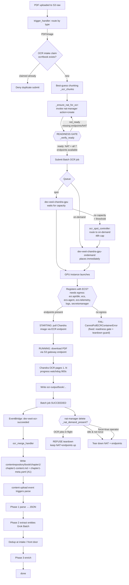

# OCR / GPU Pipeline — Current State

_Branch: `feature/concurrency-parallelism` · Last updated: 2026-09-29_

Status of the unattended, document-parallel WWII pipeline with a focus on the
GPU-OCR front door and the networking-lifecycle hardening that makes it reliable.

---

## Where we are

The OCR RUNNABLE-stall and the follow-on container-pull failure are **both
fixed and deployed**. A live on-demand OCR job (`B406`, 11 pages) has:

1. Passed the **readiness gate** (NAT + all 7 VPC interface endpoints
   `available`) before compute was requested.
2. **Registered** its GPU instance with the ECS/Batch cluster (the thing that
   failed every prior attempt).
3. **Pulled the Chandra image** via the ECR endpoints (past the point that
   failed with `CannotPullECRContainerError`).
4. Loaded the model and is **OCR-ing pages 1..11** under the progress watchdog.

Remaining to fully close: let the job finish → `ocr-output/B406/…` →
EventBridge → merge Lambda writes the chapter structure → parse triggers; then
tear down.

### Two root causes fixed this session

| # | Symptom | Root cause | Fix (commit) |
|---|---------|-----------|--------------|
| 1 | GPU job stuck RUNNABLE; instance launches but never registers | NAT + interface endpoints not reliably up at boot; nat_manager **create-after-delete race** (a `deleting` endpoint counted as "present" → recreation skipped) | Readiness contract `_verify_ready` + exclude `deleting` from the exists-check + `_wait_out_deleting` (`4bb5ee0`) |
| 2 | Instance registers, job RUNNING, then `CannotPullECRContainerError` (ECR auth timeout) | A **direct `action=delete`** tore down NAT+endpoints **under a running job** — the demand guard only ran on the SNS path | Move demand guard **into `_delete_all`** (every delete path honors in-flight OCR); `force=True` for intentional teardown (`561e71f`) |

### Not a bug (clarified)

- **Spot not placing immediately is expected.** Spot waits for capacity; the
  Option-B controller falls back to on-demand after the threshold (48h cap).
  On-demand places immediately (768 quota). Only the spot *quota* matters, and
  the ≥80% warning already surfaces it.

---

## Flow + decision points

### Key decision points (numbered)

1. **OCR intake claim** — `ocr#{book}` DynamoDB claim guards the whole chunk
   set; duplicate submits denied at the front door (dedup principle).
2. **Chunking** — page-count > 50 → 50-page chunks; image → single; unknown →
   safe whole fallback (`_ocr_chunks`).
3. **Readiness gate** (`_verify_ready`) — compute is **not requested** until
   NAT is `available` AND every required interface endpoint is `available`.
   Returns `{ready, missing[]}`. This is what makes registration reliable.
4. **Queue / spot-vs-on-demand** — spot waits for capacity (expected);
   `ocr_spot_controller` falls back to on-demand after the threshold (48h cap).
5. **Registration egress** — the instance needs the 7 interface endpoints
   (ECR/ECS/logs/secrets) to register + pull; S3 uses the gateway endpoint.
6. **Teardown guard** (`_delete_all` + `_nat_demand_present`) — refuses to tear
   down NAT/endpoints while any OCR job is non-terminal on either queue, unless
   `force=true`. Prevents infra being pulled out from under a running job.

---

## Verification evidence (this session)

- `action=verify` → `{"ready": true, "missing": []}` with all 7 endpoints
  available.
- OCR job `3283f45d-…`: RUNNABLE → STARTING (`registered=1`) → RUNNING;
  container log shows PDF downloaded, `Model loaded successfully`,
  `Loaded 11 page(s)`, `Processing pages 1-1...`.
- Gate: `scripts/gate.sh` PASS, 1161 tests (commits `4bb5ee0`, `561e71f`).

## Follow-ups

- EIP release `AuthFailure` on teardown (IAM perm gap) — minor, cleanup only.
- Full-chain close (#5): confirm merge → chapter structure → parse after this
  job SUCCEEDED; then a **true** front-door test (upload via S3 so the trigger
  does chunking + NAT-ensure + claim end-to-end).
- Tear down GPU/NAT after testing.
